# Prebloom — Progress Tracker

> **Last Updated:** 2026-02-01 04:25 UTC  
> **Current Branch:** `landing-page-kronos`  
> **Status:** 🟢 Active Development

---

## 🎯 Current Sprint Goals

1. [ ] **Deep Research Tab** — Agentic market research on-demand
2. [ ] **Mermaid Diagram** — Visual flow of idea through pipeline
3. [ ] **Pricing Strategy** — Define and document pricing model
4. [ ] **Iterate Mode** — Refine idea based on feedback
5. [ ] **PDF Export** — Improved report export
6. [ ] **History Persistence** — Store past evaluations

---

## 📊 Task Status

### In Progress
- [ ] Deep Research Tab design and implementation

### Just Completed
- [x] Mermaid diagram visualization (Pipeline tab)

### Queued
- [ ] Pricing model analysis
- [ ] Iterate mode
- [ ] PDF export improvements
- [ ] History persistence (SQLite)

### Completed This Session
- [x] Whisper model: small → medium
- [x] Cleanup: Ollama + Haiku fallback
- [x] USE_LOCAL_CLEANUP toggle
- [x] Landing page styling fixes
- [x] Documentation updates

---

## 🔬 Feature Designs

### 1. Deep Research Tab

**Concept:** A "Research" tab alongside TL;DR and Full Report that triggers on-demand deep market research.

**What it does:**
- Spawns background agents to research:
  - Market size and TAM/SAM/SOM
  - Competitor analysis (who's doing this?)
  - Trend data (is this growing?)
  - Similar startups (who raised? who failed?)
- Returns structured research report
- Cached per evaluation (don't re-run)

**UI:**
```
[TL;DR] [Full Report] [Deep Research 🔍]
                            ↓
         "Researching market..." (spinner)
                            ↓
         Market Research Report
         ├── Market Size: $X.XB
         ├── Key Competitors: [list]
         ├── Recent Funding: [list]
         └── Trend Analysis: [graph/text]
```

**Implementation:**
- New endpoint: POST /prebloom/research/:jobId
- Background agent with web search capability
- Stores results in job data
- Frontend tab shows cached or triggers new

---

### 2. Mermaid Diagram (Verdict Flow)

**Concept:** Visual diagram showing how the idea flowed through evaluation.

**What it shows:**
- Idea → Intake → Catalyst → Fire → Synthesis → Verdict
- Each node colored by score (green/yellow/red)
- Clickable nodes show that phase's analysis
- Shows WHY the verdict was reached

**Example Mermaid:**

```mermaid
graph TD
    A[💡 Idea] --> B[📥 Intake]
    B --> C[🚀 Catalyst Squad]
    B --> D[🔥 Fire Squad]
    C --> E[⚖️ Synthesis]
    D --> E
    E --> F[✅ CONDITIONAL PASS]
    
    style C fill:#22c55e
    style D fill:#f59e0b
    style F fill:#22c55e
```


**Implementation:**
- Store phase scores in verdict
- Generate Mermaid code from verdict data
- Render with mermaid.js in frontend
- Add as collapsible section in report

---

### 3. Pricing Strategy

**To analyze:**
- Current: €29/report (retail)
- Enterprise: TBD
- Freemium: ?

**Questions to answer:**
- What do competitors charge?
- What's the perceived value?
- Freemium vs paid-only?
- Volume discounts?

---

## 🧪 Testing Checklist

Before marking complete:
- [ ] Voice input works (medium model)
- [ ] Transcription cleanup works (Haiku)
- [ ] Full evaluation pipeline works
- [ ] TL;DR view renders correctly
- [ ] Full report view renders correctly
- [ ] Landing page looks correct

---

## 📁 Key Files

| Feature | Files |
|---------|-------|
| Deep Research | `src/prebloom/api/http-handler.ts`, `frontend/src/App.tsx` |
| Mermaid Diagram | `frontend/src/App.tsx`, new component |
| History | `src/prebloom/storage/` (new) |
| PDF Export | `src/prebloom/api/http-handler.ts` |

---

## 🔄 Session Handoff Notes

**For next session:**
1. Read this PROGRESS.md first
2. Check git status and current branch
3. Run `docker compose -f docker-compose.prebloom.yml ps` to verify services
4. Continue from "In Progress" section above
5. Update this file after each completed task

**Known issues:**
- Ollama local cleanup disabled (USE_LOCAL_CLEANUP=false)
- Cron permission error in backend (non-blocking)

---

## 📝 Changelog

### 2026-02-01 04:35 UTC
- ✅ Added Pipeline Flow view with Mermaid diagram
- Shows evaluation flow: Idea → Intake → Catalyst/Fire → Synthesis → Verdict
- Color-coded by score (green/yellow/red)
- Phase details with scores

### 2026-02-01 04:25 UTC
- Created PROGRESS.md
- Starting Deep Research Tab design
